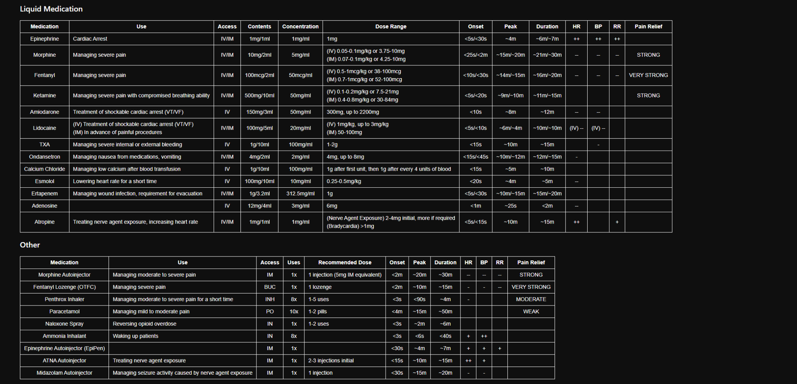

# TFJ TacMed React Native

TFJ TacMed is a React Native / Expo tactical medication calculator for Android.

It was migrated from the original native Android version into a cleaner cross-platform structure using TypeScript, Expo, and React Native.

The main purpose of this app is to calculate **route-specific medication doses** from a reference medication sheet, especially when **IV and IM doses are different**.

---

## App Logo


---

## Reference Medication Sheet



---

## Main Features

- Patient weight input in kilograms
- Medication search
- Category filters
- Medication list cards
- Medication detail screen
- Separate route calculations for IV / IM medications
- mg to mL conversion
- mcg to mL conversion
- Vial / ampule count
- Remaining volume after max calculated dose
- Dark tactical-style interface
- Expo-based Android preview and build workflow

---

## Main Correction

This version does **not** assume that IV and IM doses are the same.

Examples from the reference sheet:

```text
Morphine
IV: 0.05–0.1 mg/kg or 3.75–10 mg
IM: 0.07–0.1 mg/kg or 2.5–10 mg

Fentanyl
IV: 0.5–1 mcg/kg or 38–100 mcg
IM: 0.7–1 mcg/kg or 52–100 mcg

Ketamine
IV: 0.1–0.2 mg/kg or 7.5–21 mg
IM: 0.4–0.8 mg/kg or 30–84 mg

Lidocaine
IV: 1 mg/kg, up to 3 mg/kg
IM: 50–100 mg
```

---

## Project Structure

```text
TFJ-TacMed-ReactNative/
├── App.tsx
├── app.json
├── package.json
├── package-lock.json
├── tsconfig.json
├── babel.config.js
├── README.md
├── assets/
│   ├── icon.png
│   ├── adaptive-icon.png
│   ├── logo_source.png
│   └── sheet_medication_reference.png
└── src/
    ├── components/
    │   └── MedicationCard.tsx
    ├── data/
    │   └── medications.ts
    ├── logic/
    │   └── doseCalculator.ts
    ├── screens/
    │   ├── HomeScreen.tsx
    │   └── MedicationDetailScreen.tsx
    └── types/
        └── medication.ts
```

---

## Important Files

### `src/data/medications.ts`

Contains the medication database.

This is where medication names, concentrations, contents, routes, and dose values are stored.

### `src/logic/doseCalculator.ts`

Contains the dose calculation logic.

It calculates:

```text
Dose
Volume needed
Vials / ampules needed
Remaining volume
```

### `src/screens/HomeScreen.tsx`

Main app screen.

Handles:

```text
Weight input
Search
Category filtering
Medication list
```

### `src/screens/MedicationDetailScreen.tsx`

Detail screen for each medication.

Shows route-specific calculations and medication information.

### `src/components/MedicationCard.tsx`

Card component used to display each medication in the list.

---

## Calculation Logic

For weight-based medications:

```text
Dose = patient weight × dose per kg
```

For mg medications:

```text
Volume mL = dose mg ÷ concentration mg/mL
```

For mcg medications:

```text
Concentration mcg/mL = concentration mg/mL × 1000
Volume mL = dose mcg ÷ concentration mcg/mL
```

For vial / ampule count:

```text
Vials needed = ceil(max calculated volume ÷ vial volume)
```

For remaining volume:

```text
Remaining volume = total available volume - max calculated volume
```

---

## Requirements

Install these before running the project:

- Node.js
- npm
- Android Studio, for emulator preview
- Expo Go, optional for real phone preview

Check Node and npm:

```bash
node -v
npm.cmd -v
```

On Windows PowerShell, use `npm.cmd` if normal `npm` is blocked by execution policy.

---

## Installation

Clone the repository:

```bash
git clone https://github.com/rochdi4k/TFJ-TacMed-ReactNative.git
```

Enter the project folder:

```bash
cd TFJ-TacMed-ReactNative
```

Install dependencies:

```bash
npm.cmd install
```

Or, if normal npm works:

```bash
npm install
```

---

## Run the App

Start Expo:

```bash
npm.cmd start
```

Or:

```bash
npm start
```

Then choose one of the preview options.

### Android Emulator

1. Open Android Studio.
2. Start an emulator from Device Manager.
3. Return to the Expo terminal.
4. Press:

```text
a
```

### Real Android Phone

1. Install Expo Go from the Play Store.
2. Run the app with:

```bash
npm.cmd start
```

3. Scan the QR code using Expo Go.

The phone and computer should be on the same Wi-Fi network.

### Web Preview

Install web dependencies first:

```bash
npx.cmd expo install react-native-web react-dom @expo/metro-runtime
```

Then run:

```bash
npm.cmd start
```

Press:

```text
w
```


---


## Safety Notice

This application is a software reference calculator based on the provided medication sheet.

It must not be used as the only source for real medical decisions.

Always verify all medication values, routes, concentrations, and dose limits against official medical protocol, authorized clinical guidance, and qualified medical supervision before real use.

---

## Status

Current version:

```text
React Native / Expo migration
Route-specific medication calculator
Android-focused preview and build workflow
```

Planned improvements:

- Add non-liquid medication support
- Add manual route selector
- Add medication inventory tracking
- Add patient profile mode
- Add saved calculation history
- Add PDF report export


